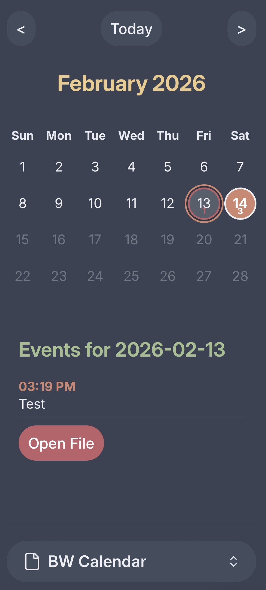
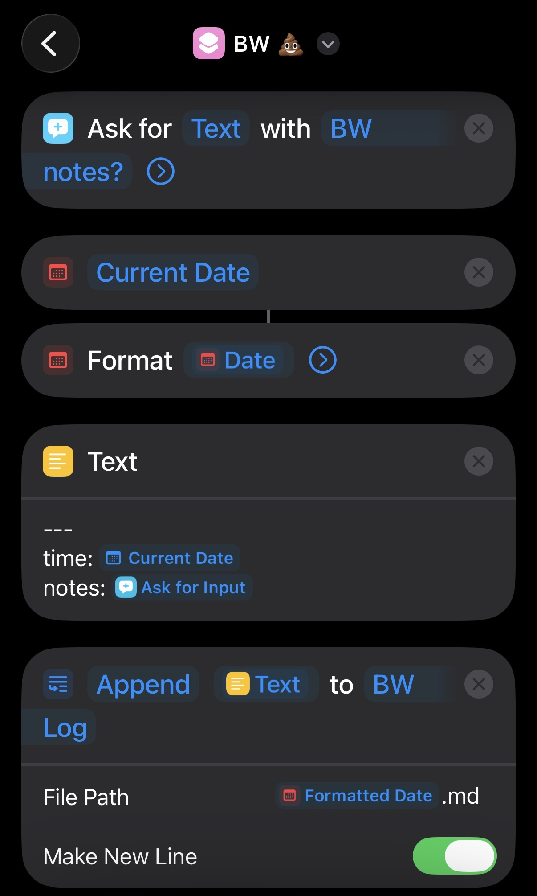

# 🗓️ Bowel Movement Calendar for Obsidian

Visualize your logged bowel movement events in an iOS-style calendar view within Obsidian. ✨

## 🚀 Features

- **🔒 Privacy & Data Ownership**: You have ultimate control over your data. All logs are stored in simple markdown files within your vault.
- **🛡️ Zero Intrusiveness**: This plugin only reads from the folder you specify and does not modify your existing notes or structure.
- **🧩 Ultimate Flexibility**: Since logs are plain text, you can use, move, or export your data however you wish, independent of this plugin.
- **📅 Wall Calendar View**: Highlights days with logged events for easy tracking.
- **📝 Event Details**: Click a day to see times and notes for all events on that day.



## ✍️ How to Log

The plugin looks for markdown files named `YYYY-MM-DD.md` in your configured logs folder. 📂

### 📋 Format
Each event entry must be preceded by a line of `---`. 
```markdown
---
time: 2026-02-14T15:19:02-08:00
notes: "Feeling good."
```

### 🤖 Automation
You can use any automated way to append these logs to your daily files. 
- **📱 iOS/macOS**: We highly recommend using **Apple Shortcuts** to quickly log events from your phone or Apple Watch. ⌚



## 🔍 How to View

1. ⚙️ Set your logs folder path in the plugin settings.
2. 🖱️ Click the **Calendar Icon** in the left ribbon or use the **"Open Calendar"** command (`Cmd+P`).
3. ➡️ The calendar will open in the right sidebar by default.

## 📦 Installation

### 🏪 From Community Plugins
Search for "Bowel Movement Calendar" in the Obsidian community plugin list.

> [!NOTE]
> **⏳ Submission Pending**: This plugin is currently being prepared for submission to the official community plugin gallery.

### 🛠️ Manual Installation
1. ⬇️ Download `main.js`, `manifest.json`, and `styles.css` from the latest release.
2. 📁 Create a folder named `bw-calendar` in your vault's `.obsidian/plugins/` directory.
3. 📄 Copy the downloaded files into that folder.
4. ✅ Enable the plugin in Obsidian settings.

## 🏗️ Future Work

- **🌍 Official Release**: Submit to the Obsidian Community Plugin gallery.
- **🎨 Custom Fields**: Support for custom metadata (e.g., Bristol scale, urgency, duration).
- **🤖 AI Insights**: Integration with local or cloud LLMs to provide insights into your bowel movement trends, health changes, and correlations with other data.
- **📈 Advanced Visualization**: Heatmaps and frequency charts.